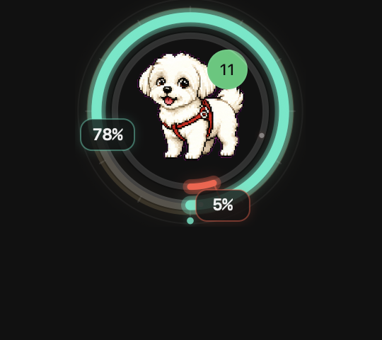

# codex-pet-limit-rings

A macOS companion app that draws usage-limit indicators around your Codex pet — no patches, no pet-specific setup, works with any pet Codex displays.



## What It Does

Your Codex pet floats on screen. This app quietly follows it, showing how much capacity you have left at a glance.

**Three display modes** — pick one in the settings panel (⌘,):

- **Rings** — Two concentric rings around the pet. Outer = short-window limit. Inner = weekly limit. Colors shift from healthy green/blue through amber to red as capacity drops.
- **Bars** — Compact horizontal progress bars above the pet's head, with percentage labels.
- **Minimal** — A small numeric readout (`72%  45%`) at the pet's top-right corner.

**Other settings:**

- **Color scheme** — Warm, Cool, Cyberpunk, or Original.
- **Data source** — Show both limits, or only short-window / weekly.
- **Readout mode** — Always visible, or hover-to-show (works for rings and bars).
- **Bar customization** — X/Y offset and thickness (when in bar mode).
- **Tracking speed** — Fast (~30fps), Medium (~12fps), or Smooth (~8fps).
- **Language** — 中文 or English.

When the pet is closed, the indicator disappears. When the pet reappears, it comes back. Multi-display setups are handled correctly — the indicator stays with the pet, not the focused screen.

The overlay is pet-agnostic. Built-in pet, custom pet, tiny dog, robot — it doesn't matter. The app only tracks the pet window that Codex is already showing.

## Why A Companion App

A menu item inside Codex itself would require patching Electron app files (`app.asar`), dealing with integrity updates, and re-signing after every Codex update. That's brittle.

`codex-pet-limit-rings` stays completely outside the Codex app. It reads local Codex state, fetches live usage data with the local ChatGPT token, and renders its own transparent always-on-top window. The result is reversible, inspectable, and agent-installable.

## Quick Start

Install as a login item:

```bash
tools/install-limit-rings.sh
```

You'll see a small icon in the macOS menu bar. Click it to toggle the overlay, refresh usage data, open settings, or quit.

Use any Codex pet normally — no setup required.

Development build (no login item):

```bash
tools/run-limit-rings.sh
```

Uninstall:

```bash
tools/uninstall-limit-rings.sh
```

## Give This Repo To Codex

This repository is structured so a Codex agent can pick it up from a GitHub link.

Ask the agent:

```text
Use the bundled codex-pet-limit-rings skill from this repository. Install the rings companion for my Codex pet, verify the LaunchAgent is running, and confirm the overlay stays anchored to the pet.
```

The agent should read:

- `AGENTS.md` for the project contract.
- `skills/codex-pet-limit-rings/SKILL.md` for the install, debug, and validation workflow.
- `docs/limit-rings.md` for the data and rendering model.

To install the bundled skill into local Codex:

```bash
tools/install-codex-skill.sh
```

## Data And Privacy

The app reads only local Codex files and one ChatGPT usage endpoint:

- `~/.codex/.codex-global-state.json` — whether the pet is open and where it is.
- `~/.codex/auth.json` — local bearer token for live usage data.
- `~/.codex/logs_2.sqlite` — cached fallback if live usage is unavailable.

No OpenAI API key required. No pet images, screenshots, prompts, or repo contents are sent anywhere.

## Project Shape

```text
tools/
  codex-pet-limit-rings.swift      native macOS companion app
  install-limit-rings.sh           build, install, and start at login
  uninstall-limit-rings.sh         remove the app and login item
  run-limit-rings.sh               development launch
  build-limit-rings.sh             app bundle builder
  install-codex-skill.sh           copy the bundled skill into ~/.codex/skills

skills/codex-pet-limit-rings/
  SKILL.md                         Codex-agent workflow for this project

docs/
  limit-rings.md                   implementation contract and data flow

experiments/weather-pets/
  earlier weather-pet renderer     kept as a separate experiment
```

## Development

Build the app:

```bash
tools/build-limit-rings.sh
```

Render a static preview:

```bash
swiftc tools/codex-pet-limit-rings.swift -o tmp/codex-pet-limit-rings -framework AppKit -lsqlite3
tmp/codex-pet-limit-rings --preview tmp/limit-rings-preview.png --size 164
```

Validate scripts:

```bash
bash -n tools/*.sh
```

## Experiments

The original exploration included a Python renderer for weather-mutated Codex pets. That work lives under `experiments/weather-pets/` so the public repo stays focused on limit rings while preserving the idea: Codex pets can become ambient interfaces for state, context, and mood.

## License

MIT. See `LICENSE`.
